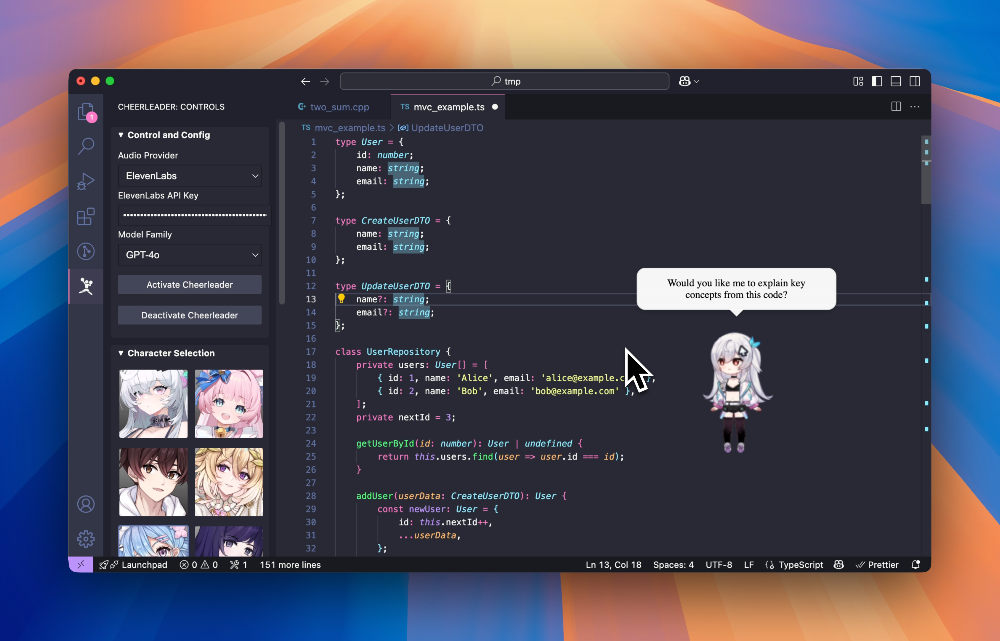
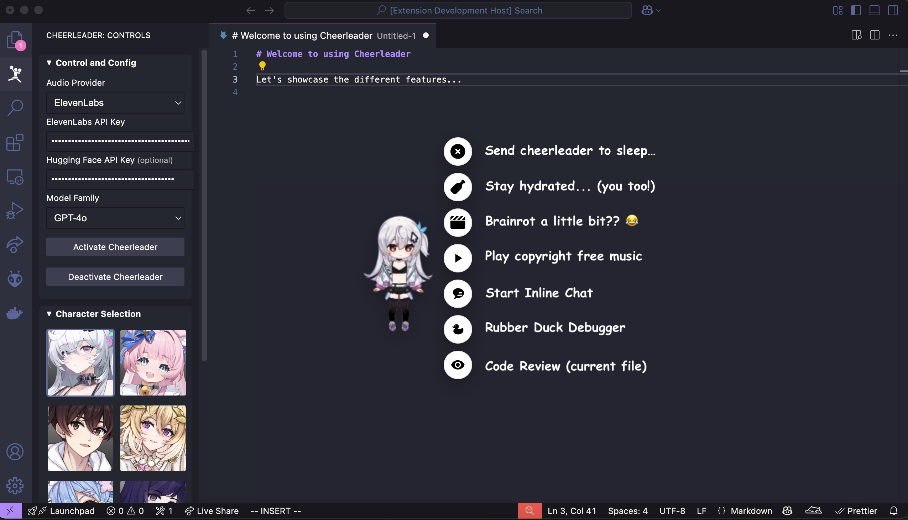
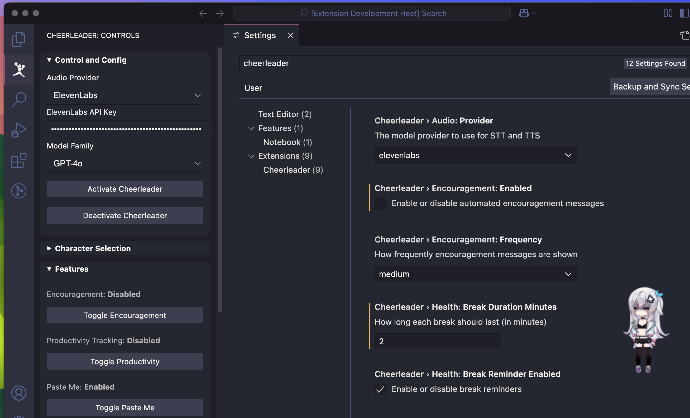
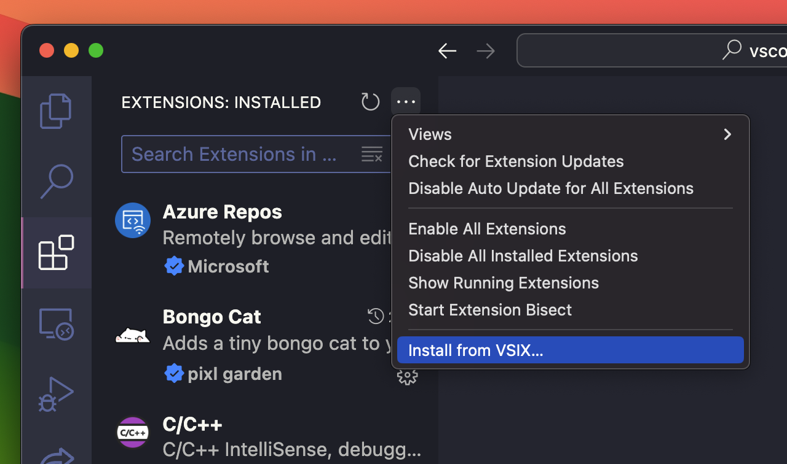
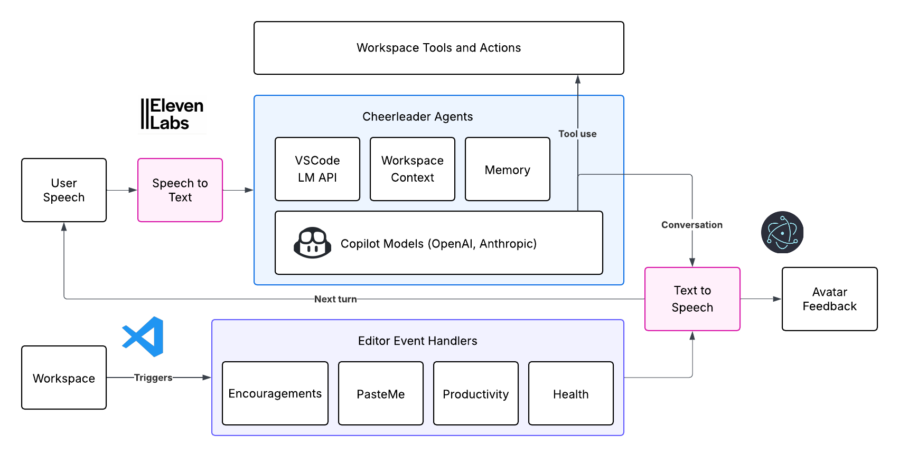

<div align="center">
  <h1>VSCode Cheerleader</h1>
  <p>Supercharge your dev experience with an anime coding companion!</p>
</div>

<div style="background-color: #ffe6e6; padding: 20px; color: #e74c3c; border-radius: 5px; border:2px solid #ff4444; margin-bottom: 20px;">
  <h2>Maintainers Wanted!</h2>
  <p>We are looking for new maintainers to help keep this project alive. Please reach out if you're interested in contributing.</p>
  <a href="/issues/60">Learn More (#60)</a>
</div>

<div align="center">
  <p align="center">
  
  </p>
</div>

<p align="center">
   <a href="https://drive.google.com/file/d/1L9_LPPqXbGecPE1ZMLq7LfBr87-3d4sq/view?usp=sharing" target="_blank">
      
   </a>
</p>

> [!IMPORTANT]
> We rely on LLMs provided through GitHub Copilot, so you must have Copilot enabled in your workspace.

## Features

**Cheerleader** brings a fun, interactive anime assistant to your VS Code environment that helps you stay motivated, productive, and engaged while coding with editor support and AI mentor.

<p align="center">
   
   <br>
   <em>Coding with your anime companion</em>
</p>

- **Interactive Avatar**: A fully customizable character that reacts to your mouse movements and clicks, bringing your workspace to life.

- **Voice Interaction**: Hit a roadblock? Talk it out with cheerleader — voice-first help that does everything Copilot Chat can, but with extra flair and personality.

- **Motivation Boost**: Get real-time encouragement and compliments based on your coding activity, console results, and LSP feedback.

- **Focus and Wellness**: Stay on track with productivity nudges and reminders to take breaks or end sessions for a healthier workflow.

> [!NOTE]
> For a detailed description of each feature, please refer to [this page](docs/features.md)

## Usage

Some background features can be configured in the sidebar, refer to the [Setup and Configuration](#setup-and-configuration) section below. Other features can be accessed through the overlay UI:

<p align="center">
   
   <br>
   <em>Try out interactive features!</em>
</p>

## Setup and Configuration

### API Keys Management

You must provide your own ElevenLabs API key for text-to-speech and speech-to-textn features. It can be obtained for free with quite generous usage limits by signing up for an account at [their website](https://elevenlabs.io/).

You can also choose to use Hugging Face's Kokoro and Whisper models for TTS and STT. You can obtained a free API key by signing up for an account at [their website](https://huggingface.co/). **However, we recommend using ElevenLabs since the free tier is much more generous for API usage.**

> [!NOTE]
> In future releases, we might consider adding local TTS and STT models to avoid the need for API keys. However, this will make the extension less accessible to many users who do not have the required hardware since these models are quite large.

### Electron.js

We require `electron.js` to create an overlay window for the cheerleader (because it is dangerous and impossible to do so within the VSCode workspace editor). We recommend installing it globally so you don't need to install it individually for every workspace.

```sh
npm install -g electron
```

> [!NOTE]
> If you do not have electron installed, a terminal will pop up when you launch the cheerleader to prompt you to install it (type Enter or "y" to install).

### Customizing Cheerleader

Other than the existing anime characters, you can use your own Live2D model, either found online or created by yourself with Live2D Cubism. To do this, paste in either the **URL** or **absolute local path** to the `model.json` file in the sidebar settings.

Here are few free collections of Live2D models on GitHub (we do not own nor are affiliated with any of these repositories):

- [iCharlesZ/vscode-live2d-models](https://github.com/iCharlesZ/vscode-live2d-models/tree/master)

- [imuncle/live2d](https://github.com/imuncle/live2d)

> [!CAUTION]
> Advanced animations and interactions are only supported on the default models we provided, because custom models might not have the same motions defined.

### Settings

You can configure the following settings in the sidebar (with cheerleader icon) OR the original settings panel (Ctrl+Shift+P -> Preferences: Open Settings (UI)):

<p align="center">
   
   <br>
   <em>Sidebar (left) and VSCode settings panel (right)</em>
</p>

Available setitngs include:

- **API Keys**: Enter your ElevenLabs or Hugging Face API key for TTS and STT features.

- **Copilot Models**: Choose which Copilot models to use for inline chat and code review. Currently, we support `gpt4o`, `gpt4o-mini`, and `claude-3.5-sonnet`. Note that `o1` and `o1-mini` are said to be supported in their documentation but somehow not in reality...

- **Anime Character**: Choose your favorite anime character from the list. The cheerleader will reload with the new character after a few seconds.

- **Features Toggle**: Enable or disable different features of the cheerleader.

- **Feature Settings**: Configure settings like break reminder interval, time to quit session, etc from both the sidebar and the original settings panel

## Installation

### VSCode Extensions Marketplace

We are officially listed on the VSCode Marketplace. Just search for "Cheerleader" in the extensions tab of VSCode and install it from there.

### From VSIX

We provide a packaged version of the extension for every major and minor release. You can find the latest version and download the `cheerleader-<version>.vsix` file from the [Releases](https://github.com/georgeistes/vscode-cheerleader/releases) page.

Then, open VSCode and go to the extensions tab. Under more options, select "Install from VSIX" and select the `.vsix` file you just built to install it.



### From Source

`node.js` and `npm` are required for installing from source. You can install them from npm's [official website](https://docs.npmjs.com/downloading-and-installing-node-js-and-npm).

1. Clone the repo:

   ```sh
   git clone https://github.com/endernoke/vscode-cheerleader
   ```

2. Install `electron.js`, which is required for rendering the interactive cheerleader. We recommend installing globally so you don't need to install it individually for every workspace.

   ```sh
   npm install -g electron
   ```

3. Install project dependencies:

   ```sh
   npm install
   ```

4. Install the VScode extension CLI

   ```sh
   npm install -g @vscode/vsce
   ```

5. In the project directory, run the following command to generate a `.vsix` file:

   ```sh
   cd path/to/vscode-cheerleader
   vsce package
   ```

6. This tool will generate a `.vsix` file in the current directory. You can then install it in VSCode following the instructions in [From VSIX](#from-vsix).

## How It Works

Cheerleader is the world's first interactive anime assistant for VSCode powered by VSCode API and Copilot.



In addition, the character avatar is rendered using the [PixiJS](https://pixijs.com/) library, which is a 2D rendering engine that uses WebGL and HTML5. The character model is built using [Live2D](https://www.live2d.com/en/) technology.

In the future, we plan to extend more unique functionalities to the cheerleader that would make programming more fun and engaging while also improving productivity and convenience. 

> [!NOTE]
> We welcome contributions and suggestions from the community so that we know what features you would like to see in the future. Feel free to open an issue or PR on our GitHub repository.

## Philosophy

**We believe coding should feel less like solitary, mundane work and more like a creative jam session.** That’s why we built the cheerleader — not just as an assistant, but as a vibrant, voice-driven companion that brings energy, motivation, and a bit of fun to your coding flow.

Most coding agents today (like Copilot, Cursor, or Roo) are powerful but sterile — all utility, no personality. They’re optimized for efficiency, but forget that creativity thrives in an environment that’s playful, human, and a little unexpected.

We also see coding as inherently social — even when you’re solo. That's why rubber-duck debugging and pair programming have been so popular and effective.

Cheerleader is here to complement these tools and emphasize **reflection and growth**. It’s ideal for moments when you want to think through a problem, like grinding LeetCode or learning a new language — not just vibe code your way through it. Our goal isn’t to automate away the effort, but to make the effort more meaningful. That’s how human skill is perfected.

**We're building a collaborator with charm.** One that talks, listens, celebrates small wins, and nudges you forward when you hit a wall. Programming should be powerful _and_ delightful. That’s our philosophy.

## Commands Catalog

If you wish to execute any of the commands **manually**, you can do so by opening the command palette (Ctrl+Shift+P) and type the command name:

- `cheerleader.launchOverlay`: Launch the cheerleader overlay
- `cheerleader.killOverlay`: Stop the cheerleader overlay
- `cheerleader.inlineChat`: Open a text-based inline chat for the current file
- `cheerleader.inlineChatVoice`: Start a voice-based inline chat for the current file **(Key binding: ctrl/cmd+shift+c)**
- `cheerleader.rubberDuckVoice`: Start a voice-based rubber duck debugging session **(Key binding: ctrl/cmd+shift+d)**
- `cheerleader.reviewCode`: Run a code review on the current file **(Key binding: ctrl/cmd+shift+r)**
- `cheerleader.explainPastedCode`: Explain the pasted code

- `cheerleader.toggleEncouragement`: Toggle encouragement features on/off
- `cheerleader.toggleMonitoringRotting`: Toggle productivity monitoring
- `cheerleader.togglePasteMonitoring`: Toggle paste me feature

The following commands are used for testing and development purposes, categorized under "Testing":

- `cheerleader.record`: Test recording audio
- `cheerleader.testTTS`: Test text-to-speech functionality
- `cheerleader.testEncouragement`: Test encouragement messages

## Contributing

This is an open-source project and we welcome contributions! Let's make VSCode a more fun and productive place for developers by reimagining human-computer interaction. Please refer to the [CONTRIBUTING.md](CONTRIBUTING.md) file for guidelines on how to contribute.

## License

Released under the [MIT License](LICENSE).

The interactive anime cheerleader is built with live2d. Note that none of the live2d models used are owned by the authors of this repository. The copyrights of all Live2D models, images, and motion data belong to their respective original authors (e.g. [HakkoAI](https://www.doudou.fun)). They should not be used for commercial purposes.

You can visit the official [Live2D website](https://www.live2d.com/en/) or their [GitHub repo](https://live2d.github.io) for more information about the technology and its licensing:

Live2D Cubism Core is provided under the [Live2D Proprietary Software License](https://www.live2d.com/eula/live2d-proprietary-software-license-agreement_en.html). 

Live2D Cubism Components are provided under the [Live2D Open Software License](http://www.live2d.com/eula/live2d-open-software-license-agreement_en.html).

> The terms and conditions do prohibit modification, but obfuscating in `live2d.min.js` would not be considered illegal modification ([source](https://community.live2d.com/discussion/140/webgl-developer-licence-and-javascript-question)).

## Credits

Authors: [James Zheng](https://www.linkedin.com/in/james-zheng-zi), [Jet Chiang](https://www.linkedin.com/in/jet-chiang)

We salute to the authors and contributors of the following awesome repositories/projects:

- [guansss/pixi-live2d-display](https://github.com/guansss/pixi-live2d-display)
- [HakkoAI (逗逗游戏伙伴)](https://www.doudou.fun)
