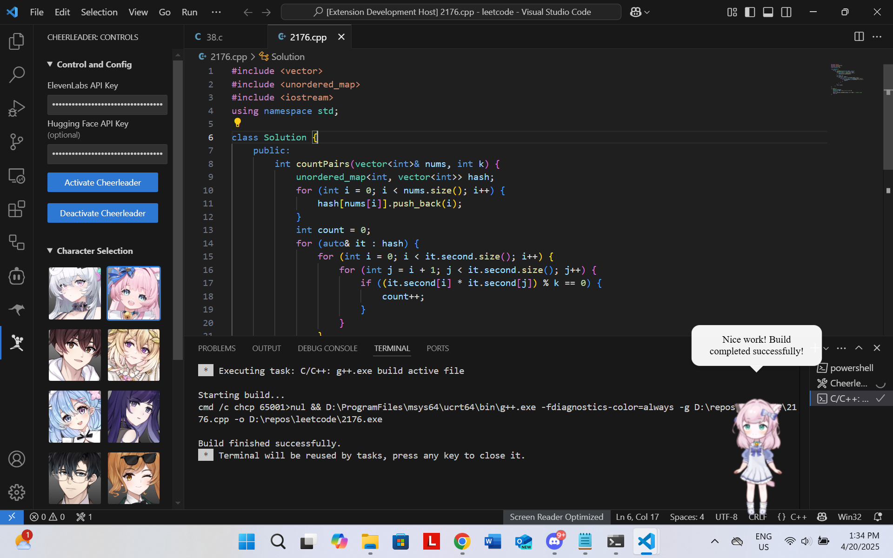

# Cheerleader

<p align="center">
  <br>
  Supercharge your dev experience with an anime coding companion!
</p>

> [!IMPORTANT]
> We rely on LLMs provided through GitHub Copilot, so you must have Copilot enabled in your workspace.

## Features

Cheerleader brings a fun, interactive anime assistant to your VS Code environment that helps you stay motivated, productive, and engaged while coding with editor support and AI mentor.

<p align="center">
   
   <br>
   <em>Coding with your anime companion</em>
</p>

- Interactive anime character that floats on your screen and motivates you

- Audio code support and AI assistance such as inline chat, code review, rubber duck debugging that integrates with your editor (like Copilot but entirely voice-based)

- Get encouraging messages based on your coding activity, console output, build/test results, LSP feedback, and more

- Cheer you up with productivity monitoring, music, and compliments

> For a detailed description of each feature, please refer to [this page](docs/features.md)

## Usage

Some background features can be configured in the sidebar, refer to the [Setup and Configuration](#setup-and-configuration) section below. Other features can be accessed through the overlay UI:

<p align="center">
   
   <br>
   <em>Try out interactive features!</em>
</p>

## Setup and Configuration

### API Keys Management

You must provide your own ElevenLabs API key for text-to-speech and speech-to-textn features. It can be obtained for free with quite generous usage limits by signing up for an account at [their website](https://elevenlabs.io/).

> [!CAUTION]
> In the pre-release version, we used to support both ElevenLabs and HuggingFace. However, we have currently discontinued support for HuggingFace since the Kokoro TTS API is not reliable.

> [!NOTE]
> In future releases, we might consider adding local TTS and STT models to avoid the need for API keys. However, this will make the extension less accessible to many users who do not have the required hardware since these models are quite large.

### Settings

You can configure the following settings in the sidebar (with cheerleader icon):

- **API Keys**: Enter your ElevenLabs or Hugging Face API key for TTS and STT features.

- **Copilot Models**: Choose which Copilot models to use for inline chat and code review. Currently, we support `gpt4o`, `gpt4o-mini`, and `claude-3.5-sonnet`. Note that `o1` and `o1-mini` are said to be supported in their documentation but somehow not in reality...

- **Anime Character**: Choose your favorite anime character from the list. The cheerleader will reload with the new character after a few seconds.

- **Features Toggle**: Enable or disable different features of the cheerleader.

> [!NOTE]
> In a future release soon you will be able to bring any Live2D model you want by providing a URL. We will also expand the default catalog to include characters other than anime.

## Installation

### VSCode Extensions Marketplace

We are officially listed on the VSCode Marketplace. Just search for "Cheerleader" in the extensions tab of VSCode and install it from there.

### From VSIX

We provide a packaged version of the extension for every major and minor release. You can find the latest version and download the `cheerleader-<version>.vsix` file from the [Releases]() page.

Then, open VSCode and go to the extensions tab. Under more options, select "Install from VSIX" and select the `.vsix` file you just built to install it.


### From Source

`node.js` and `npm` are required for installing from source. You can install them from npm's [official website](https://docs.npmjs.com/downloading-and-installing-node-js-and-npm).

1. Clone the repo:

   ```sh
   git clone https://github.com/endernoke/vscode-cheerleader
   ```

2. Install `electron.js`, which is required for rendering the interactive cheerleader. We recommend installing globally so you don't need to install it individually for every workspace.

   ```sh
   npm install -g electron
   ```

3. Install project dependencies:

   ```sh
   npm install
   ```

4. Install the VScode extension CLI

   ```sh
   npm install -g @vscode/vsce
   ```

5. In the project directory, run the following command to generate a `.vsix` file:

   ```sh
   cd path/to/vscode-cheerleader
   vsce package
   ```

6. This tool will generate a `.vsix` file in the current directory. You can then install it in VSCode following the instructions in [From VSIX](#from-vsix).

## Commands Catalog

If you wish to execute any of the commands **manually**, you can do so by opening the command palette (Ctrl+Shift+P) and type the command name:

- `cheerleader.launchOverlay`: Launch the cheerleader overlay
- `cheerleader.killOverlay`: Stop the cheerleader overlay
- `cheerleader.inlineChat`: Open a text-based inline chat for the current file
- `cheerleader.inlineChatVoice`: Start a voice-based inline chat for the current file **(Key binding: ctrl/cmd+shift+c)**
- `cheerleader.rubberDuckVoice`: Start a voice-based rubber duck debugging session **(Key binding: ctrl/cmd+shift+d)**
- `cheerleader.reviewCode`: Run a code review on the current file **(Key binding: ctrl/cmd+shift+r)**
- `cheerleader.explainPastedCode`: Explain the pasted code

- `cheerleader.toggleEncouragement`: Toggle encouragement features on/off
- `cheerleader.toggleMonitoringRotting`: Toggle productivity monitoring
- `cheerleader.togglePasteMonitoring`: Toggle paste me feature

The following commands are used for testing and development purposes, categorized under "Testing":

- `cheerleader.record`: Test recording audio
- `cheerleader.testTTS`: Test text-to-speech functionality
- `cheerleader.testEncouragement`: Test encouragement messages

## Requirements

- VS Code
- Node.js
- Electron.js
- Microphone access (for voice interaction features)
- GitHub Copilot

## Contributing

This is an open-source project and we welcome contributions! Let's make VSCode a more fun and productive place for developers by reimagining human-computer interaction. Please refer to the [CONTRIBUTING.md](CONTRIBUTING.md) file for guidelines on how to contribute.

## License

Released under the [MIT License](LICENSE).

The interactive anime cheerleader is built with live2d. Note that none of the live2d models used are owned by the authors of this repository. The copyrights of all Live2D models, images, and motion data belong to their respective original authors (e.g. [HakkoAI](https://www.doudou.fun)). They should not be used for commercial purposes.

You can visit the official [Live2D website](https://www.live2d.com/en/) or their [GitHub repo](https://live2d.github.io) for more information about the technology and its licensing:

Live2D Cubism Core is provided under the [Live2D Proprietary Software License](https://www.live2d.com/eula/live2d-proprietary-software-license-agreement_en.html). 

Live2D Cubism Components are provided under the [Live2D Open Software License](http://www.live2d.com/eula/live2d-open-software-license-agreement_en.html).

> The terms and conditions do prohibit modification, but obfuscating in `live2d.min.js` would not be considered illegal modification ([source](https://community.live2d.com/discussion/140/webgl-developer-licence-and-javascript-question)).

## Credits

Authors: [James Zheng](https://www.linkedin.com/in/james-zheng-zi), [Jet Chiang](https://www.linkedin.com/in/jet-chiang)

We salute to the authors and contributors of the following awesome repositories/projects:

- [guansss/pixi-live2d-display](https://github.com/guansss/pixi-live2d-display)
- [HakkoAI (逗逗游戏伙伴)](https://www.doudou.fun)
