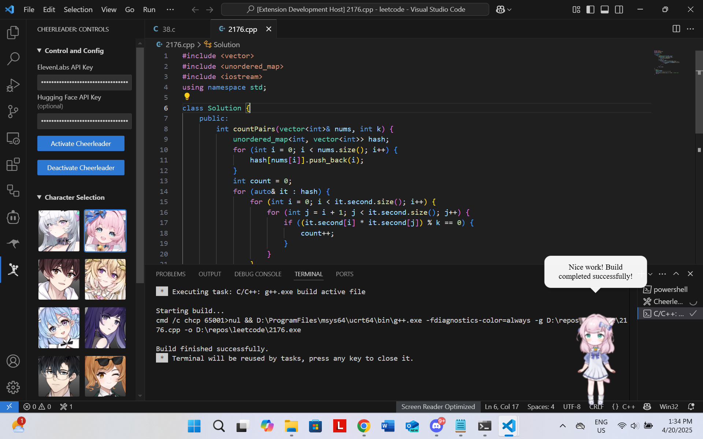

# Cheerleader

<p align="center">
  <br>
  Supercharge your dev experience with an anime coding companion!
</p>

## Features

Cheerleader brings a fun, interactive anime assistant to your VS Code environment that helps you stay motivated, productive, and engaged while coding with editor support and AI mentor.

<p align="center">
   
   <br>
   <em>Coding with your anime companion</em>
</p>

### Interactive Anime Companion

- An interactive anime character that floats on your screen and provides encouragement
- Choose from multiple character models to be your coding companion
- Position your cheerleader anywhere on your screen
- Interact with your cheerleader with the mouse or action buttons

### Code Support & AI Assistance

- Ask questions about your code using text or voice
- Receive constructive comments, explanations, and suggested edits for your code

### Editor Features

- Get encouraging messages based on your coding activity
- Hear cheerful feedback when you complete tasks like builds or tests
- Get recognized for consistent coding sessions

- Monitor your productivity and get gentle reminders when you stray
- Toggle background lofi music to help you focus
- Get motivated when you've been inactive for too long

## Usage

We will be adding a detailed description of each button on Cheerleader for better readability soon, stay tuned...

### Character Interaction

- Click and drag the character to reposition it
- Use the buttons around the character to access features:
  - Chat button: Start an inline chat
  - Code review button: Review your current file
  - Music button: Toggle lofi background music

### Voice Commands

1. Click on the microphone button or use the `cheerleader.startVoiceInteraction` command
2. Speak your question or request
3. Click "Stop" when you're done speaking
4. Your cheerleader will process your speech and respond both visually and with audio

### Code Review

1. Open a file you want to review
2. Run the `cheerleader.reviewCode` command or click the code review button
3. Cheerleader will analyze your code and provide helpful feedback with voice explanations

### Inline Chat

1. Open a file you want to discuss
2. Run `cheerleader.inlineChat` , `cheerleader.inlineChatVoice`, or use the inline chat button
3. Ask questions about your code
4. Receive conversational responses, code comments, or detailed explanations

### Settings

- Access the cheerleader controls from the sidebar
- Configure API keys for text-to-speech and speech-to-text processes
- Switch between different cheerleader characters
- Toggle encouragement features on/off
- Toggle productivity tracking on/off

### API Keys Management

You are required to provide your own ElevenLabs API key for text-to-speech feature. They provide free API keys with quite generous usage limits. You can sign up for an account and get your API key from [ElevenLabs](https://elevenlabs.io/).

We also offer an alternative speech-to-text service using [Hugging Face](https://huggingface.co/), which is free to use. You can sign up for an account and get your API key for free. Otherwise, we will use ElevenLabs by default.

> [!NOTE]
> In future releases, we might consider adding local TTS and STT models to avoid the need for API keys. However, this will make the extension less accessible to many users who do not have the required hardware since these models are quite large.

## Installation

### VSCode Extensions Marketplace

We will be available on the VSCode Extensions Marketplace soon. For now, you can install from source with the steps below.

## From Source

`node.js` and `npm` are required for installing from source. You can install them from npm's [official website](https://docs.npmjs.com/downloading-and-installing-node-js-and-npm).

1. Clone the repo:

   ```sh
   git clone https://github.com/endernoke/vscode-cheerleader
   ```

2. Install `electron.js`, which is required for rendering the interactive cheerleader. We recommend installing globally so you don't need to install it individually for every workspace.

   ```sh
   npm install -g electron
   ```

3. Install project dependencies:

   ```sh
   npm install
   ```

4. Install the VScode extension CLI

   ```sh
   npm install -g @vscode/vsce
   ```

5. In the project directory, run the following command to generate a `.vsix` file:

   ```sh
   cd path/to/vscode-cheerleader
   vsce package
   ```

6. Open VSCode and go to the extensions tab. Under more options, select "Install from VSIX" and select the `.vsix` file you just built to install it.

## Extension Settings

Extension settings can be configured in the activity sidebar under the cheerleader icon.

You can configure:

- Your ElevenLabs API key for text-to-speech, Hugging Face API key for speech-to-text
- Copilot models to use (gpt4o, gpt4o-mini, claude-3.5-sonnet), note that o1 and o1-mini are said to be supported on their documentation but somehow not in reality...
- Anime character (takes a few seconds to reload, so be patient)
- Toggle on/off different editor features

> [!NOTE]
> In a future release soon you will be able to bring any Live2D model you want by providing a URL. We will also expand the default catalog to include characters other than anime.

## Commands

- `cheerleader.inlineChatVoice`: Start a voice-based inline chat for the current file
- `cheerleader.reviewCode`: Run a code review on the current file
- `cheerleader.startVoiceInteraction`: Start a voice interaction with the cheerleader

- `cheerleader.toggleEncouragement`: Toggle encouragement features on/off
- `cheerleader.toggleMonitoringRotting`: Toggle productivity monitoring
- `cheerleader.togglePasteMe`: Toggle paste me feature **(TO BE ADDED)**

The following commands are used for testing and development purposes, categorized under "Testing":

- `cheerleader.testTTS`: Test text-to-speech functionality
- `cheerleader.testEncouragement`: Test encouragement messages
- `cheerleader.startRecording`: Start recording audio
- `cheerleader.stopRecording`: Stop recording audio
- `cheerleader.inlineChat`: Open a text-based inline chat for the current file

## Requirements

- VS Code
- Node.js
- Electron.js
- Microphone access (for voice interaction features)
- GitHub Copilot

> [!IMPORTANT]
> We rely on LLM provided through GitHub Copilot, so you must have Copilot enabled in your workspace. At this time we do not support other vendors like OpenAI or Anthropic. Here is how to enable it...

## Contributing

This is an open-source project and we welcome contributions! Let's make VSCode a more fun and productive place for developers by reimagining human-computer interaction. Please refer to the [CONTRIBUTING.md](CONTRIBUTING.md) file for guidelines on how to contribute.

## License

Released under the [MIT License](LICENSE).

The interactive anime cheerleader is built with live2d. Note that none of the live2d models used are owned by the authors of this repository. The copyrights of all Live2D models, images, and motion data belong to their respective original authors (e.g. [HakkoAI](https://www.doudou.fun)). They should not be used for commercial purposes.

You can visit the official [Live2D website](https://www.live2d.com/en/) or their [GitHub repo](https://live2d.github.io) for more information about the technology and its licensing:

Live2D Cubism Core is provided under the [Live2D Proprietary Software License](https://www.live2d.com/eula/live2d-proprietary-software-license-agreement_en.html). 

Live2D Cubism Components are provided under the [Live2D Open Software License](http://www.live2d.com/eula/live2d-open-software-license-agreement_en.html).

> The terms and conditions do prohibit modification, but obfuscating in `live2d.min.js` would not be considered illegal modification ([source](https://community.live2d.com/discussion/140/webgl-developer-licence-and-javascript-question)).

## Credits

Authors: [James Zheng](https://www.linkedin.com/in/james-zheng-zi), [Jet Chiang](https://www.linkedin.com/in/jet-chiang)

We salute to the authors and contributors of the following awesome repositories/projects:

- [guansss/pixi-live2d-display](https://github.com/guansss/pixi-live2d-display)
- [HakkoAI (逗逗游戏伙伴)](https://www.doudou.fun)
